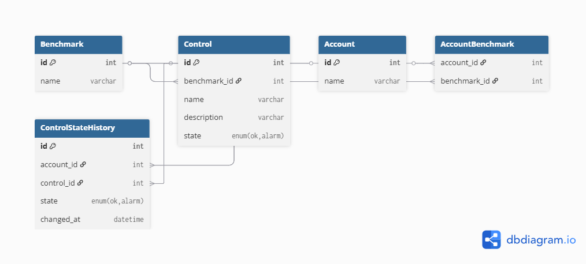

# User API Project

# First Task — Database Design (Benchmarks per Account)

## MER

The following diagram represents the conceptual model:



### Entities
- **Benchmark**: represents a set of controls.
- **Control**: belongs to a Benchmark and has a current state (ok/alarm).
- **Account**: represents a user/owner who can have multiple Benchmarks.
- **AccountBenchmark**: join table for the many-to-many relationship between Account and Benchmark.
- **ControlStateHistory**: stores each state change for a given control and account, with timestamp.

---

## Use Cases & Recommended Indexes

### Q1) List benchmarks with their controls and the current state for an account
- **Index**: `(account_id, benchmark_id)` on **AccountBenchmark**  
  *Purpose*: Quickly retrieve all benchmarks associated with an account.

### Q2) List benchmarks with their controls and state changes within a time range
- **Index**: `(account_id, control_id, changed_at)` on **ControlStateHistory**  
  *Purpose*: Efficient filtering by account, control, and time interval.

### Q3) Get benchmarks with their controls and the state at a specific date/time (snapshot)
- **Index**: `(account_id, control_id, changed_at)` on **ControlStateHistory**  
  *Purpose*: Quickly find the latest record before or at that timestamp.

---

# Second Task — REST API of Users

## REST API — Users

This API allows reading user data from a mock JSON file (`mock-users.json`) with filtering, pagination, and proper HTTP responses.

## Requirements

Before running the project, make sure you have the following tools installed:

- [Docker](https://docs.docker.com/get-docker/) 
- [Docker Compose](https://docs.docker.com/compose/install/)  

## Getting Started

Clone the repository and enter the project folder:
```bash
git clone https://github.com/Carloshipol/user-api.git
cd user-api
```
### Running the API

```bash
docker-compose up --build
```
The API will be available at `http://localhost:8000/api`.

### Example Requests

**List users (default pagination):**
```bash
curl http://localhost:8000/api/users
```

**List users with filters:**
```bash
curl "http://localhost:8000/api/users?page=2&page_size=5&q=Bruno&role=manager&is_active=true"
```

**Get user by ID:**
```bash
curl http://localhost:8000/api/users/1
```
### Base URL
```
http://localhost:8000/api
```

### Endpoints

#### GET `/users`
Retrieve a list of users with optional filters and pagination.

**Query Parameters:**
| Parameter   | Type    | Default | Description |
|------------|---------|---------|-------------|
| `page`     | int     | 1       | Page number |
| `page_size`| int     | 10      | Items per page (max 50) |
| `q`        | string  | —       | Search by name or email |
| `role`     | string  | —       | Filter by role (e.g., admin, manager) |
| `is_active`| boolean | —       | Filter by active status (`true`/`false`) |

**Response 200:**
```json
{
  "data": [
    {
      "id": 1,
      "name": "Bruno Nogueira",
      "email": "bnogueira1@widgets.org",
      "role": "manager",
      "is_active": true,
      "created_at": "2024-05-26T17:11:48Z"
    }
  ],
  "pagination": {
    "page": 1,
    "page_size": 10,
    "total": 25,
    "total_pages": 3
  }
}
```

#### GET `/users/{id}`
Retrieve a user by ID.

**Response 200:**
```json
{
  "data": {
    "id": 1,
    "name": "Bruno Nogueira",
    "email": "bnogueira1@widgets.org",
    "role": "manager",
    "is_active": true,
    "created_at": "2024-05-26T17:11:48Z"
  }
}
```

**Response 404:**
```json
{
  "error": "User not found"
}
```

### Features Implemented
- Pagination (`page`, `page_size`)  
- Search by name/email (`q`)  
- Filtering by `role` and `is_active`  
- JSON response envelope with `data` and `pagination`  
- Error handling with proper HTTP status codes  
- Logging with Laravel `Log::info` and `Log::warning`  
- CORS configured via `config/cors.php`  
- Full Docker support with multi-stage build, auto-generated APP_KEY, and Apache ready on port 8000
- Unit & Feature Tests**: PHPUnit tests for `/users` and `/users/{id}`, including pagination, filtering, and 404 responses.

---


